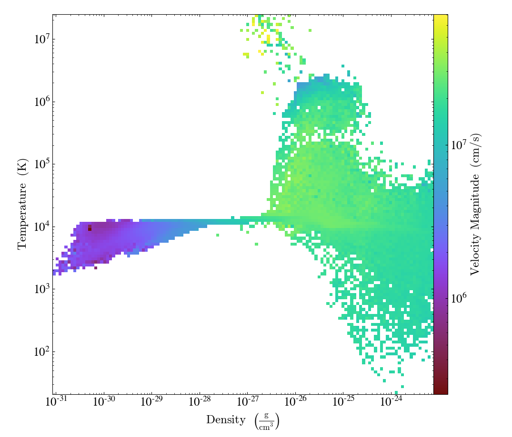

## Phase Plot Example

### Description of data

This repository contains a dataset (`data/galaxy.json.gz`) with an example output from an
astrophysical code. The data is structured as list of "grids", where a single grid is a mapping that
looks like:

  - *left_edge* - coordinates of the left edge of the grid in simulation length unit (float64 x 3)
  - *right_edge* - coordinates of the right edge of the grid in simulation length unit (float64 x 3)
  - *level* - adaptive mesh refinement level (int64)
  - *dimensions* - shape of the grid (int64 x 3)
  - *density* - values of gas density and their unit (list of lists following *dimensions*, str)
  - *temperature* - values of gas temperature  (list of lists following *dimensions*, str)
  - *velocity_magnitude* - values of gas velocity magnitude (list of lists following *dimensions*, str)

### Goal

The task is to create 2D distribution of **velocity magnitude** enclosed in **density** and **temperature** bins 
using any available tools in the python ecosystem.

It should resemble this:

